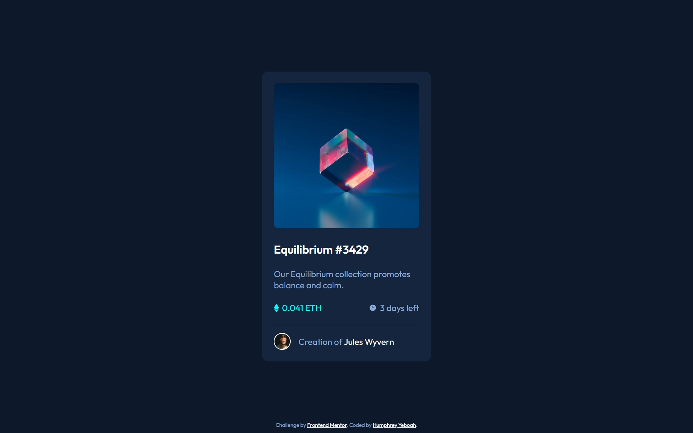

<!-- @format -->

# Frontend Mentor - NFT preview card component solution

This is a solution to the [NFT preview card component challenge on Frontend Mentor](https://www.frontendmentor.io/challenges/nft-preview-card-component-SbdUL_w0U). Frontend Mentor challenges help you improve your coding skills by building realistic projects.

## Table of contents

- [Overview](#overview)
  - [The challenge](#the-challenge)
  - [Screenshot](#screenshot)
  - [Links](#links)
- [My process](#my-process)
  - [Built with](#built-with)
  - [What I learned](#what-i-learned)
- [Author](#author)

## Overview

### The challenge

Users should be able to:

- View the optimal layout depending on their device's screen size
- See hover states for interactive elements

### Links

- Solution URL: [Github repo](https://github.com/hakylepremier/nft-card-component)
- Live Site URL: [Live site link](https://hakylepremier.github.io/nft-card-component/)

## My process

### Built with

- Semantic HTML5 markup
- CSS(BEM)
- Flexbox

### What I learned

I relearned that the body tag comes with a default margin so its best to take it out when you start styling your page.

## Author

- Website - [Humphrey Yeboah](https://www.humphreyyeboah.com)
- Frontend Mentor - [@hakylepremier](https://www.frontendmentor.io/profile/hakylepremier)
- Twitter(X) - [@hakylepremier](https://www.twitter.com/hakylepremier)
